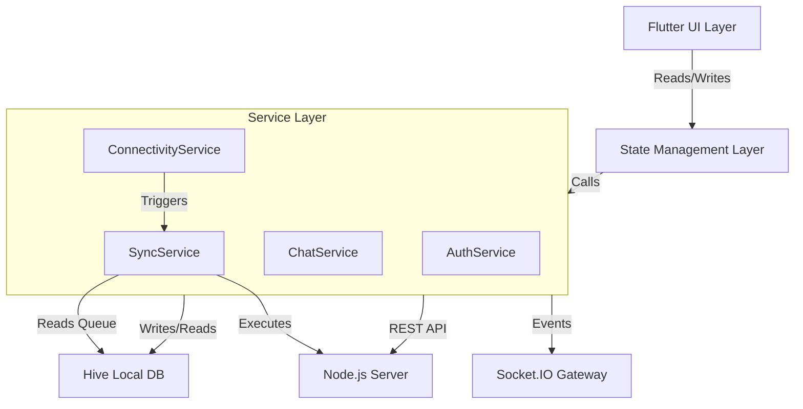

# Lutions Connect - Mobile Architecture Case Study

**Disclaimer:** "Lutions Connect" is a proprietary commercial application developed for Lution Group. This repository does **NOT** contain source code or internal business logic. It serves as a technical case study demonstrating the system architecture, engineering challenges, and solutions I implemented as the Lead Mobile Developer.

## 📱 Project Overview

Lutions Connect is a cohesive platform merging **Real-time Messaging** with **Professional Recruitment**. It enables users to chat, manage groups, and navigate complex job recruitment workflows in a unified mobile experience.

The application was built to solve a specific problem: bridging the gap between casual professional networking and formal hiring processes, all while maintaining **100% data integrity** in low-network environments.

## 🛠️ Tech Stack & Tools

### Core Framework

- **Flutter & Dart**: Cross-platform mobile development.
- **Provider**: Dependency injection and state management using the ChangeNotifier pattern.

### Backend & Infrastructure

- **Node.js (REST API)**: Handles authentication, user data, and job workflows.
- **Socket.IO**: Real-time bidirectional event-based communication.
- **Supabase**: Cloud object storage for media assets (chat images, profile pictures).
- **Firebase (FCM)**: Push notifications for background alerts and deep linking.

### Local Persistence & Offline

- **Hive (NoSQL)**: High-performance local database for caching messages, user profiles, and job feeds.
- **Shared Preferences**: Secure storage for session tokens and theme preferences.

### Key Libraries

- **connectivity_plus**: Real-time network status monitoring.
- **flutter_screenutil**: Pixel-perfect responsive design across device sizes.
- **cached_network_image**: Efficient image caching with custom retry logic.
- **intl**: Date formatting and localization.

## 🏗️ Key Engineering Challenges & Solutions

### 1. The "Offline-First" Architecture

**Challenge:** Users in areas with unstable internet lost data if they sent messages or applied for jobs while offline.

**Solution:**

- **Command Pattern Implementation**: Designed a custom Action Queuing System. When offline, user actions (e.g., SendMessage, ApplyJob) are serialized into PendingAction objects and stored in Hive.
- **Singleton Connectivity Service**: Implemented a singleton service listening to connectivity_plus streams. It broadcasts network state changes globally across the app.
- **Background Sync Engine**: Developed a SyncService that triggers automatically when connectivity is restored. It retrieves queued actions from Hive and processes them sequentially with exponential backoff logic.

**Result:** Achieved "Optimistic UI" updates where the app feels instant, while ensuring data consistency with the server.

### 2. Real-Time Synchronization & Timezones

**Challenge:** Users in different timezones experienced message ordering bugs, and group chat states became inconsistent.

**Solution:**

- **UTC Standardization**: Enforced strict UTC timestamps across the entire stack (Database → API → UI) to ensure chronological consistency.
- **Global Event Listeners**: Engineered a decoupled SocketService that listens for events like `new_message` or `group_update` globally. It updates the local Hive cache immediately, ensuring the UI is consistent even if the user is on a different screen.
- **Delivery Receipts**: Implemented a real-time status system (Sent → Delivered → Read) using socket acknowledgments.

### 3. Complex State Management (Provider Architecture)

**Challenge:** Managing interdependent states (e.g., a Job Application status affecting a Chat Room) without spaghetti code.

**Solution:**

**Decoupled Providers:** Split logic into specialized providers:

- **ChatProvider**: Handles message history and local caching.
- **JobProvider**: Manages the recruitment state machine (Applied → Shortlisted → Hired).
- **FriendProvider**: Syncs real-time online/offline status updates.

**Dependency Injection:** Utilized MultiProvider to inject core services (AuthService, DatabaseService) into UI consumers, making the code testable and modular.

### 4. Dynamic Theming Engine

**Challenge:** The app required a customizable UI that could adapt to user preferences without restarting.

**Solution:**

- Built a **Dynamic Theme System** that caches user preferences (Light/Dark/Custom Color Schemes) locally using ThemeStorageService.
- Implemented a custom **ThemeProvider** that rebuilds the MaterialApp widget tree instantly upon selection, providing a seamless user experience.

## 📂 System Architecture Visualization



## 🤝 Collaboration & Role

**Role:** Lead Mobile Engineer (Core Developer)

- **Mobile Ownership:** Architected and engineered the complete Flutter application, managing the full lifecycle from feature design to beta deployment.
- **Full Stack Integration:** Partnered with the Backend Engineer to design the REST API schema and WebSocket event protocols, ensuring efficient data payload sizes for mobile.
- **Code Review & Quality:** Regularly reviewed backend logic (Node.js) to ensure compatibility with mobile requirements and contributed fixes to the Supabase/Render infrastructure to optimize real-time message delivery.

## 📸 Application Structure (Sanitized)

A high-level view of the project structure demonstrating separation of concerns.

```
lib/
├── main.dart              # Entry point with offline service initialization
├── models/                # Data models (User, Message, JobPost) with Hive adapters
├── providers/             # State management (AuthProvider, ChatProvider, JobProvider)
├── services/              # Business logic (ConnectivityService, SyncService, SocketService)
├── screens/               # UI Screens (ChatScreen, JobDetailScreen, ProfileScreen)
├── widgets/               # Reusable components (MessageBubble, JobCard, OfflineBanner)
├── theme/                 # Dynamic theme logic and color schemes
└── utils/                 # Helpers (DateFormatter, Validators)
```
